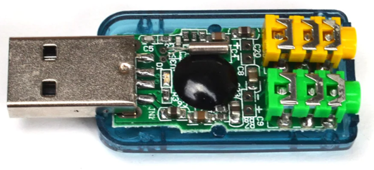
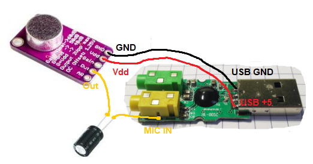
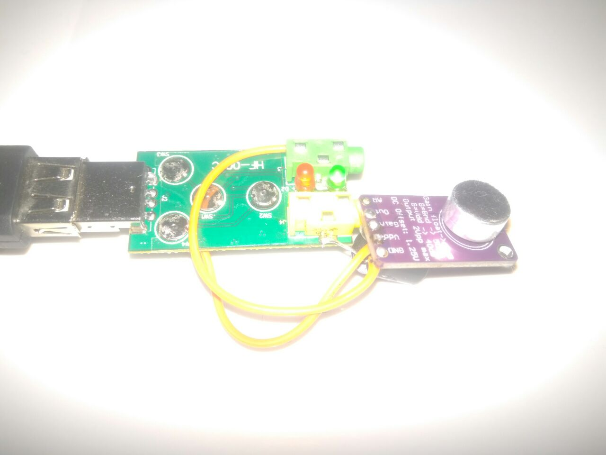
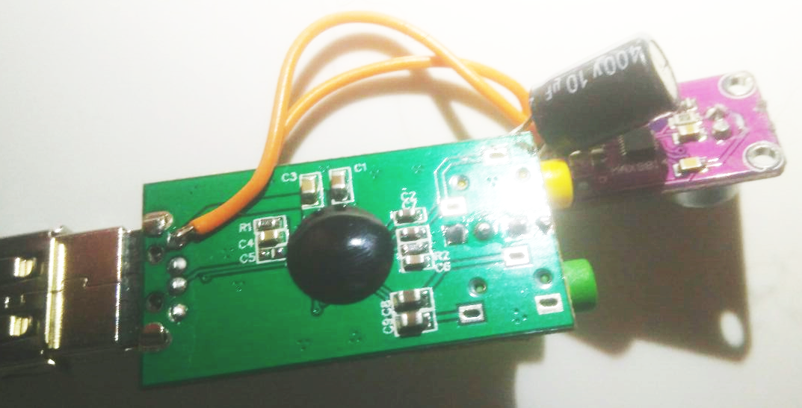
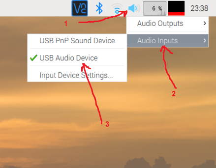

# 3$ DIY HIGH-SENSITIVE Mic for your Raspberry or PC.
This instruction contains the information how to make very sensitive USB microphone to work with Raspberries and PCs.
I have DIY this microphone for using with Raspberry together with MagicMirror module and MMM-AssistantMk2 (and MMM-Hotword) modules.

Raspberries (all models including most popular PRi4, RPi 3) do  not have on-board microphone, so you need to use the external one. 
You can find many different options of the mic on the market. 
We will show you the cheap and reliable option of the Mic which could be used together with this module and for any other purposes in your hardware setup.
We will use only native DC 5v from USB for mic powering, so no extra power is needed.

## Required hardware:
1.	Microphone module MAX9814, MAX9812 or MAX4466
For this example we will use MAX9814 with cost about 1.5$ https://www.aliexpress.com/item/32863198849.html 
2.	USB sound card
For this example we will use cheapest sound card with cost about 1$ https://www.aliexpress.com/item/1823823296.html 
3.	Wires
4.	Recommended : capacitor 1-100mF
For this example we will use cheapest one with cost about 0.1$ 
http://www.aliexpress.com/af/capacitor-10mf.html 

## Steps:
1. Remove box cover from the USB sound card in order to be able to attach the mic directly to the usb card electronic circuit. You will get similar to this device. Remember which jack is for speaker and which one for mic.

2. Solder the Mic module directly to the USB sound card using the following soldering schematic:

We have soldered MAX9814 directly to the sound card through the capacitor in order to decrease electrical interferences made to the mic.
 
NOTE: capacitor 1-100mF is optional. It adds some protection to sound card inputs against high voltage from mic. In most cases it is optional.
3.	Plug-in your USB sound card with Mic to any of RPi’s available USB port
4.	Open your Raspbian volume control panel, select USB Audio Device 

## Test 
Test your Mic setup by running from Terminal

`arecord -f S16_LE -d 3 test.wav && aplay test.wav`

This command will record the audio for 3 seconds (test.wav) and will play it using default speakers immediately after recording stop.

## Licenses and disclaimers
### Note:
This hardware set-up will give a very sensitive microphone. Try to change sensitivity using “Input device setting” dialog to found the best option for you environment. In silent room and distance between speaker and microphone about 3 meters the sensitivity is good at level 4%.
### Disclaimer: 
This guideline is provided in this article for educational purposes only.  Authors are not responsible for any damages due to use of this guideline. Be careful and take this guideline on your own risk.
